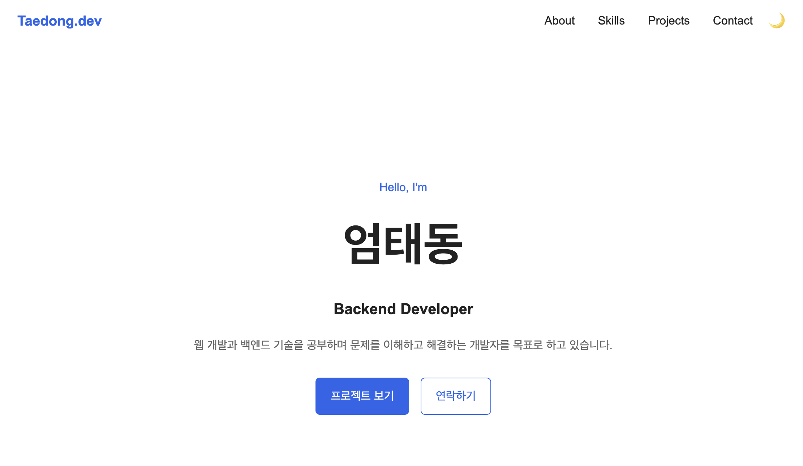
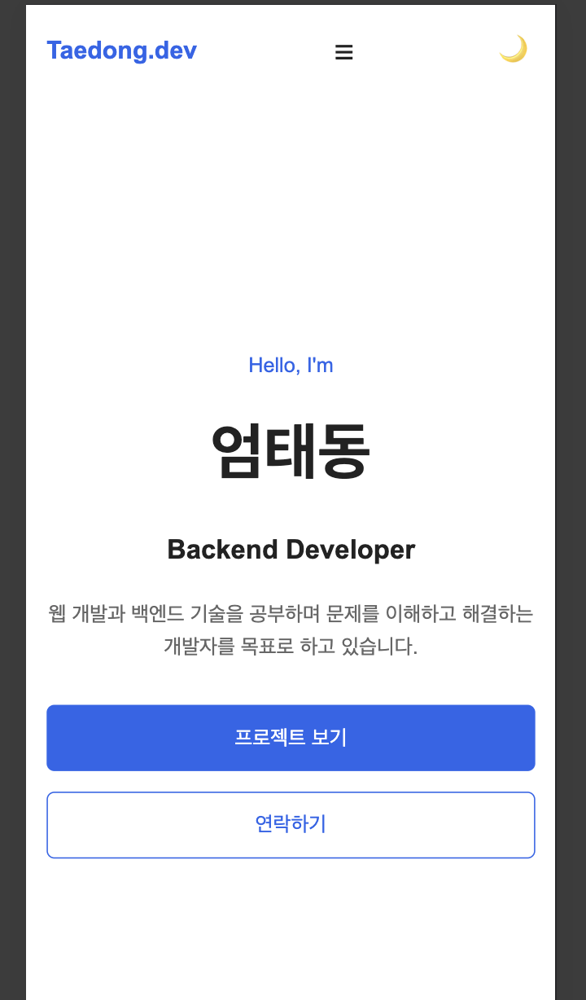
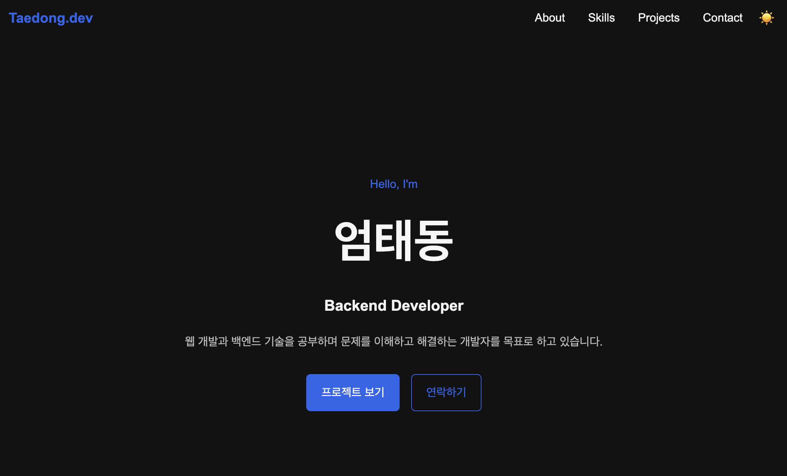

# 체크리스트 

- [ ] 프로젝트 기본 파일 구성 만들기
- [ ] HTML 전체 구조 작성하기
- [ ] CSS 기본 스타일 + 반응형 레이아웃 구현하기
- [ ] 햄버거 메뉴 / 스크롤 / 다크모드 기능 구현하기
- [ ] GitHub API 연동하고 선택한 프로젝트만 표시하기
- [ ] 로딩 / 에러 / 빈 상태 처리하기
- [ ] Contact 폼 유효성 검사 구현하기
- [ ] Intersection Observer 스크롤 애니메이션 구현하기
- [ ] 모바일 / 태블릿 / 데스크톱 화면 확인하기
- [ ] 다크모드와 새로고침 후 상태 유지 확인하기
- [ ] GitHub Pages로 배포하기
- [ ] 배포된 사이트에서 모든 기능 다시 테스트하기
- [ ] 데스크톱 / 모바일 / 다크모드 스크린샷 찍기
- [ ] README 작성 및 배포 URL 추가하기

# Vanilla JS Portfolio

순수 HTML, CSS, JavaScript로 구현한 반응형 개인 포트폴리오 웹사이트입니다.

React, Vue 등의 프레임워크 없이 DOM 조작, 이벤트 처리, 상태 변경, 비동기 API 호출을 직접 구현하는 것을 목표로 제작했습니다.

## 주요 기능

- 모바일 / 태블릿 / 데스크톱 반응형 레이아웃
- 모바일 햄버거 메뉴
- 부드러운 섹션 이동
- 스크롤 위치에 따른 Header 스타일 변경
- Scroll Top 버튼
- 다크 모드 전환 및 LocalStorage 상태 유지
- Intersection Observer 기반 스크롤 애니메이션
- GitHub API 기반 프로젝트 목록 렌더링
- 프로젝트 로딩 / 성공 / 에러 / 빈 상태 처리
- GitHub API 재시도 버튼 및 403 오류 처리
- Contact Form 필수값 및 이메일 형식 유효성 검사

## 기술 스택

- HTML5
- CSS3
- JavaScript (Vanilla JS)
- GitHub REST API
- LocalStorage
- Intersection Observer
- GitHub Pages

## 프로젝트 구조

```text
vanilla-js-portfolio/
├── index.html
├── README.md
├── css/
│   └── style.css
├── js/
│   └── main.js
└── images/
```

## 반응형 디자인

모바일 퍼스트 방식으로 작성했습니다.

- Mobile: 기본 스타일
- Tablet: 768px 이상
- Desktop: 1024px 이상

Navigation은 Flexbox를 사용하고 Projects 카드 영역은 CSS Grid의 `auto-fit`, `minmax()`를 사용해 화면 크기에 따라 자동으로 배치되도록 구현했습니다.

## 주요 인터랙션

### 햄버거 메뉴

모바일에서 햄버거 버튼을 클릭하면 `classList.toggle('active')`를 이용해 메뉴를 열고 닫습니다.

### 스크롤 기능

- Header 스타일 변경 기준: 60px
- Scroll Top 버튼 표시 기준: 300px
- Intersection Observer threshold: 0.2

Navigation 링크는 `scrollIntoView()`를 이용해 해당 Section으로 부드럽게 이동합니다.

### 다크 모드

사용자가 테마 버튼을 클릭하면 `data-theme` 값을 변경합니다.

선택된 테마는 LocalStorage에 저장하여 새로고침 후에도 유지됩니다.

## GitHub API

GitHub REST API를 `fetch`와 `async/await`로 호출하여 Repository 데이터를 가져옵니다.

```text
https://api.github.com/users/TaeDongUm/repos
```

포트폴리오에 표시할 Repository 이름만 설정값으로 관리하고, 실제 Repository의 설명, 언어, Star, URL 등은 GitHub API 응답 데이터를 사용합니다.

API 호출 과정에서 다음 상태를 UI로 구분해 처리합니다.

- Loading: 프로젝트를 불러오는 중
- Success: 프로젝트 카드 렌더링
- Empty: 표시할 프로젝트가 없는 경우
- Error: 프로젝트를 불러오지 못한 경우
- Retry: 다시 시도 버튼 제공
- 403: GitHub API 요청 제한 안내

## ES6+ 사용

- `const`
- 화살표 함수
- 템플릿 리터럴
- 구조분해 할당
- `map()`
- `filter()`
- `forEach()`
- `async/await`

## Contact Form

Contact Form은 다음 항목을 검증합니다.

- 이름 필수 입력
- 이메일 필수 입력
- 이메일 형식 검사
- 메시지 필수 입력

`input` 이벤트를 이용해 입력 중 상태를 갱신하고, `submit` 이벤트에서는 `event.preventDefault()`로 기본 제출 동작을 막은 뒤 전체 값을 다시 검증합니다.

현재 필수 과제 범위에서는 실제 이메일 전송 기능은 구현하지 않았습니다.

## 이벤트 → 상태 → 렌더링

이 프로젝트에서는 다음과 같은 흐름을 구현했습니다.

### Theme

```text
Theme 버튼 클릭
→ theme 변경
→ data-theme 변경
→ CSS 변수 변경
→ 화면 변경
```

### GitHub API

```text
API 호출
→ Loading 표시
→ API 응답
→ Success / Empty / Error
→ Projects 영역 업데이트
```

### Form

```text
사용자 입력
→ 유효성 검사
→ Form 상태 변경
→ 에러 메시지 표시/제거
```

### Hamburger Menu

```text
버튼 클릭
→ active 클래스 변경
→ Navigation 표시 상태 변경
```

## 실행 방법

저장소를 Clone합니다.

```bash
git clone https://github.com/TaeDongUm/vanilla-js-portfolio.git
cd vanilla-js-portfolio
```

VS Code에서 `index.html`을 Live Server로 실행합니다.

## 배포

GitHub Pages를 사용합니다.

예상 배포 URL:

```text
https://taedongum.github.io/vanilla-js-portfolio/
```

GitHub Repository에서 다음과 같이 설정합니다.

```text
Settings
→ Pages
→ Build and deployment
→ Deploy from a branch
→ main
→ /root
```

## Screenshots

배포 후 다음 스크린샷을 추가하기

### Desktop



### Mobile



### Dark Mode



---

### 1. HTML에서 시맨틱 태그를 왜 사용했으며, 어떤 기준으로 구조를 설계했나요?

시맨틱 태그는 단순히 화면을 나누는 용도가 아니라, 각 영역이 어떤 의미와 역할을 가지는지 HTML 자체에서 표현하기 위해 사용했습니다.

페이지 상단 영역에는 `<header>`, 주요 메뉴에는 `<nav>`, 핵심 콘텐츠 영역에는 `<main>`, 각각의 콘텐츠 구역에는 `<section>`, 독립적인 콘텐츠에는 `<article>`, 페이지 하단에는 `<footer>`를 사용했습니다.

반면 `<div>`는 특별한 의미를 표현하기보다는 CSS를 통한 레이아웃 배치나 여러 요소를 하나의 그룹으로 묶어야 할 때 사용했습니다.

즉, 의미를 가지는 영역에는 시맨틱 태그를 사용하고, 단순한 배치나 그룹화가 필요한 경우에는 `<div>`를 사용하는 기준으로 구조를 설계했습니다.

### 2. CSS에서 Flexbox와 Grid의 차이는 무엇이며, 각각 언제 사용했나요?

Flexbox는 기본적으로 한 방향으로 요소를 정렬하거나 배치할 때 적합하고, Grid는 행과 열을 기준으로 여러 요소를 배치할 때 적합하다고 판단했습니다.

Navigation 영역에서는 로고와 메뉴를 하나의 행에 정렬해야 했기 때문에 Flexbox를 사용했습니다.

Projects 영역에서는 여러 프로젝트 카드를 화면 크기에 따라 자동으로 배치해야 했기 때문에 CSS Grid를 사용했습니다.

특히 Projects에서는 `auto-fit`과 `minmax()`를 사용하여 화면 너비에 따라 카드의 열 개수가 자동으로 변경되도록 구현했습니다.

### 3. `querySelector`로 DOM을 선택하고 `addEventListener`로 이벤트를 연결하는 흐름을 어떻게 구현했나요?

먼저 `querySelector` 또는 `querySelectorAll`을 사용하여 JavaScript에서 제어할 HTML 요소를 선택했습니다.

이후 선택한 요소에 `addEventListener`를 등록하여 사용자의 `click`, `scroll`, `input`, `submit` 등의 이벤트를 감지하도록 구현했습니다.

이벤트가 발생하면 상태나 DOM의 클래스, 속성, 텍스트 등을 변경하여 실제 화면이 변경되도록 구현했습니다.

즉, `DOM 요소 선택 → 이벤트 등록 → 사용자 행동 감지 → 상태 또는 DOM 변경 → 화면 업데이트`의 흐름으로 기능을 구성했습니다.

### 4. 화살표 함수, 구조분해 할당, 배열 메서드(`map`, `filter`, `forEach`)는 왜 사용했나요?

화살표 함수는 이벤트 콜백이나 작은 함수들을 간결하게 작성하기 위해 사용했습니다.

구조분해 할당은 GitHub API에서 전달받은 Repository 객체에서 `name`, `description`, `language`, `html_url` 등 필요한 값만 한 번에 추출하기 위해 사용했습니다.

`filter()`는 GitHub API를 통해 가져온 전체 Repository 중 포트폴리오에 표시할 프로젝트만 선택하기 위해 사용했습니다.

`map()`은 선택된 Repository 데이터를 프로젝트 카드 형태의 HTML 문자열로 변환하기 위해 사용했습니다.

`forEach()`는 여러 Navigation Link나 Intersection Observer 대상 요소를 순회하면서 각각 이벤트를 등록하거나 처리하기 위해 사용했습니다.

이를 통해 반복문을 직접 작성하는 것보다 코드의 목적을 명확하게 표현할 수 있었습니다.

### 5. `fetch`와 `async/await`로 비동기 데이터를 가져오고, 로딩/성공/실패 상태를 어떻게 표현했나요?

GitHub API는 네트워크를 통해 데이터를 받아와야 하기 때문에 비동기 처리가 필요했습니다.

`fetch()`를 사용하여 GitHub API에 Repository 데이터를 요청했고, 응답을 기다리기 위해 `async/await`를 사용했습니다.

API 요청 중에는 사용자가 현재 상태를 알 수 있도록 로딩 메시지를 표시했습니다.

요청에 성공하면 Repository 데이터를 프로젝트 카드 형태로 렌더링했고, 데이터가 없는 경우에는 빈 상태 메시지를 표시했습니다.

API 요청에 실패하거나 GitHub API 요청 제한이 발생한 경우에는 `try/catch`를 통해 오류를 처리하고, 에러 메시지와 다시 시도 버튼을 표시했습니다.

이를 통해 `Loading → Success / Empty / Error` 상태를 각각 구분하여 UI에 표현했습니다.

### 6. 하나의 기능을 만들기 위해 이벤트 → 상태 변경 → DOM 업데이트가 어떻게 연결되도록 구현했나요?

사용자의 이벤트가 발생하면 바로 화면만 변경하는 방식보다는, 먼저 애플리케이션의 상태를 변경한 후 해당 상태를 기준으로 화면을 다시 렌더링하는 구조를 사용했습니다.

예를 들어 다크모드 버튼을 클릭하면 현재 테마 상태를 변경하고, 변경된 상태를 LocalStorage에 저장한 뒤 렌더링 함수를 호출하여 `data-theme` 속성과 버튼 표시를 변경했습니다.

GitHub API에서도 API 요청이 시작되면 프로젝트 상태를 `loading`으로 변경하고, 요청이 성공하면 `success` 상태와 Repository 데이터를 저장했으며, 실패하면 `error` 상태와 오류 메시지를 저장한 뒤 해당 상태를 기준으로 Projects 영역을 다시 렌더링했습니다.

폼에서도 사용자의 입력 이벤트가 발생하면 입력값의 유효성 상태를 변경하고, 해당 상태에 따라 에러 메시지와 입력 필드의 스타일을 업데이트했습니다.

이처럼 `사용자 이벤트 → 상태 변경 → 렌더링 함수 호출 → DOM 업데이트 → 화면 변경`의 흐름을 기준으로 기능을 구현했습니다.

이 구조를 통해 React에서 사용하는 상태 기반 렌더링 방식의 기초 개념을 직접 경험할 수 있었습니다.

